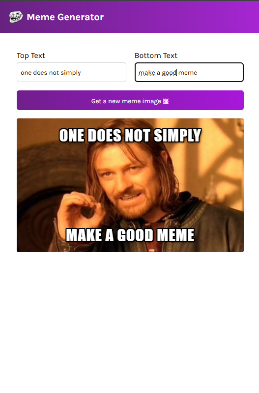

Meme generator with imgflip API
Get a random meme image and type up to 2 input text caption

Created along with react course, learning about useEffect().

Possible improvements:
    - Some images have more than 2 caption boxes, so we can apply the same number of <input> elements as the images received. The api provides that number for each image. said

    - give the user the possibility to move the text up and down or right and left . It may be necessary for some images

